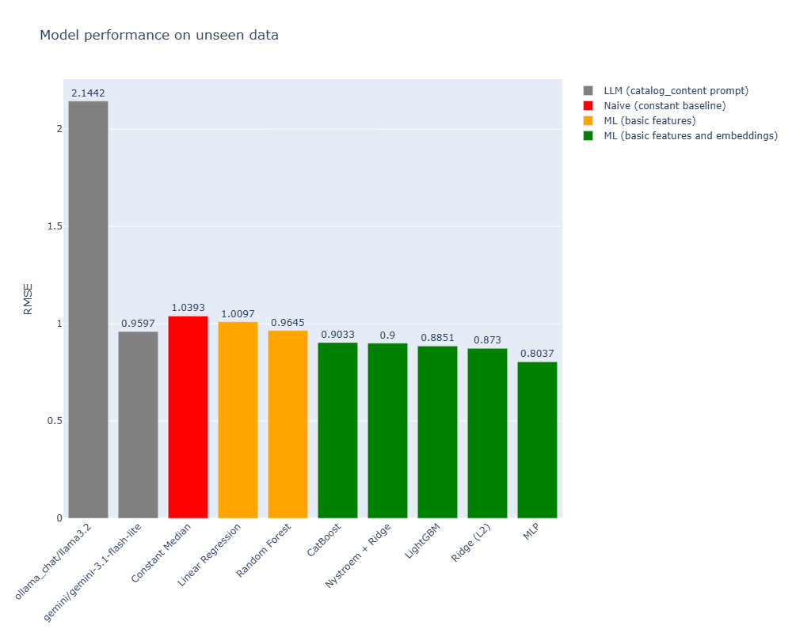

# Product Price Estimator

---- 

#Sklearn #Regressors #ML #Embeddings #LLM #QLoRA

This project builds a predictor of price of retail products from their description.

Link to app -> .... TBD

## Project Methodology


This project explores a progression of approaches:

- classical machine learning on engineered features [`research/notebooks/02_classical_models.ipynb`]
- text embeddings as dense semantic representations [`research/notebooks/02_classical_models.ipynb`]
- frontier LLM inference [`research/notebooks/03_llm_models.ipynb`]
- and QLoRA fine-tuning for local open-source LLMs [`research/notebooks/03_llm_models.ipynb`]

The dataset comes from Kaggle:
[Amazon Catalog Price Dataset](https://www.kaggle.com/datasets/debarghamitraroy/amazon-catalog-price-dataset?resource=download)

It contains approximately 75,000 labeled products.

The target variable used throughout the project is:

- `log_price`

The main evaluation metric is:

- RMSE


## Models results overview




## Repository Overview

```text
pricing-amazon-products/
├── gradio_app.py
├── app/
│   ├── ui.py
│   ├── utils.py
├── data/
│   ├── raw/
│   ├── interim/
│   ├── processed/
│   ├── embeddings/
│   ├── splits/
│   └── llm_predictions/
│   └── models/
├── research/
│   ├── notebooks/
│   │   ├── 01_eda_and_preprocessing.ipynb
│   │   ├── 02_classical_models.ipynb
│   │   ├── 03_llm_models.ipynb
│   │   └── 04_models_comparison.ipynb
│   └── experiments/
└── src/
    └── pricing_amazon_products/
        ├── config.py
        ├── io.py
        ├── preprocessing.py
        ├── embeddings.py
        ├── experiments.py
        ├── inference.py
        └── fine_tuning.py
